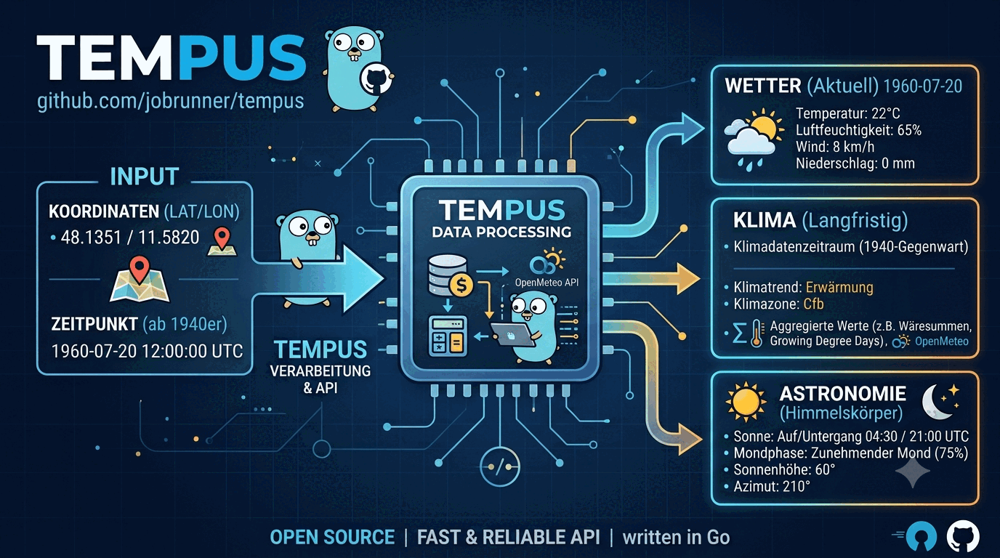

# tempus

**tempus** beantwortet die Frage: *Wie war es an diesem Ort zu dieser Zeit?*
Aus Koordinate + Zeitpunkt baut der Dienst eine GeoJSON-FeatureCollection aus
Wetter, Klima-Normalen und Astronomie — jedes Feature mit verpflichtender
Quellenangabe.

## Projektbeschreibung



## Was drinsteckt

| Provider | Liefert |
|---|---|
| `open-meteo` | Temperatur, Luftfeuchte, Niederschlag, Wind, Bewölkung, WMO-Code |
| `dewpoint` | Taupunkt und Behaglichkeit (aus dem Wetter-Feature abgeleitet) |
| `sun` / `moon` | Sonnen-/Mondstand, Auf- und Untergang, Dämmerung, Mondphase |
| `aggregate` | Vorangegangener Niederschlag (24/72/120 h), Tages-Extrema, Wärmesummen (GDD) |
| `bioclim` | 19 BIO-Variablen, Köppen-Geiger-Klimazone, Höhenstufe, Thermotyp |

Dazu kommen ein **Batch-Endpunkt** für viele Punkte auf einmal (synchron oder
als NDJSON-Stream) und ein eingebautes Web-Frontend unter `/`.

## Schnellstart

```bash
go build -o tempus ./cmd/tempus
./tempus
```

Oder als Container:

```bash
docker run --rm -p 8080:8080 ghcr.io/jobrunner/tempus:latest
```

Eine Abfrage — München am 20. Juli 1960, mittags:

```bash
curl "http://localhost:8080/api/v1/query?lat=48.1351&lon=11.5820&datetime=1960-07-20T12:00:00Z"
```

Viele Punkte auf einmal:

```bash
curl -X POST http://localhost:8080/api/v1/query/batch \
  -H 'Content-Type: application/json' \
  -H 'Accept: application/x-ndjson' \
  -d '{"points":[
        {"id":"fund-1","lat":48.1351,"lon":11.5820,"datetime":"1960-07-20T12:00:00Z"},
        {"id":"fund-2","lat":47.4200,"lon":10.9800,"datetime":"1984-08-14T09:30:00Z"}
      ]}'
```

## Oberflächen

| Pfad | Zweck |
|---|---|
| `/` | Web-Frontend (Einzelabfrage und Batch-Tab) |
| `/api/v1/query` | Einzelne Koordinate + Zeitpunkt |
| `/api/v1/query/batch` | Batch, synchron oder als NDJSON-Stream |
| `/api/v1/providers` | Verfügbare Provider samt Lizenzangaben |
| `/docs`, `/openapi.json` | API-Dokumentation und OpenAPI-Spezifikation |
| `/health`, `/health/live`, `/health/ready` | Health- und Readiness-Probes |

## Zwei Eigenheiten, die man kennen sollte

- **HTTP 200 auch bei Provider-Fehlern.** Fehlschläge einzelner Provider stehen
  im Antwort-Envelope (`providers[].status`, `retryable`), nicht im Statuscode.
  Ein Client kann so die erfolgreichen Teile verwenden und gezielt nachfragen.
- **Quellenangabe ist Pflicht.** Jedes Feature trägt einen `license`-Block mit
  `name`, `url` und `attribution`. Fehlt eines davon, wird das Feature an der
  Port-Grenze abgewiesen und der Provider als `error` (nicht retrybar) im
  Envelope gemeldet — statt unattributierte Daten auszuliefern.

## Dokumentation

Die vollständige Dokumentation liegt in [`docs/`](docs/index.md) und ist nach
[Diátaxis](https://diataxis.fr/) gegliedert:

| Abschnitt | Inhalt |
|---|---|
| [Tutorials](docs/tutorials/index.md) | Erste Schritte: Dienst starten, erste Abfrage |
| [How-to](docs/how-to/index.md) | Rezepte: lokal betreiben, historisches Wetter abfragen, Provider konfigurieren |
| [Reference](docs/reference/http-api.md) | HTTP-API, Konfigurationsschlüssel, Observability |
| [Explanation](docs/explanation/architecture.md) | Architektur, Retry-Semantik, Caching-Modell |

## Entwicklung

```bash
make verify   # fmt, vet, lint, Tests, Architektur- und Debt-Gates
make test     # nur Tests
make docs     # Dokumentations-Site bauen
```

Gebaut mit Go 1.26 in hexagonaler Architektur (Ports und Adapter); die
Import-Grenzen werden per `depguard` erzwungen, Komplexität und Testabdeckung
über Ratchet-Gates in CI gehalten.

## Lizenz

Drei Ebenen, die nicht vermischt werden dürfen:

| Ebene | Regelung |
|---|---|
| Der Dienst (dieser Go-Code) | [MIT](LICENSE) |
| Die Algorithmen | Urheber-Attribution, keine Lizenz |
| Die Daten | Lizenz der jeweiligen Quelle |

MIT deckt **ausschließlich** den Code dieses Repositorys. Die verwendeten
Verfahren und Daten gehören ihren Urhebern und Anbietern: Magnus-Tetens mit
Sonntag-1990-Koeffizienten für den Taupunkt, die WorldClim-Definitionen und
Köppen-Geiger für die BIO-Variablen, ERA5 über Copernicus/ECMWF und Open-Meteo
für die Wetterdaten.

Die Zuschreibung reist mit den Daten und ist **erzwungen**, nicht nur
dokumentiert: jedes Feature trägt einen `license`-Block (`name`, `url`,
`attribution`), und `FeatureService` validiert ihn an der Port-Grenze, bevor ein
Feature in die Antwort gelangt. Ein Provider oder Deriver, der den Block
unvollständig lässt, bekommt den Status `error` (nicht retrybar, denn ein
erneuter Versuch liefert denselben leeren Block) und sein Feature wird nicht
ausgeliefert. Wer tempus-Antworten weiterverwendet, bekommt die Angaben also
verlässlich mit und sollte sie mitführen.
